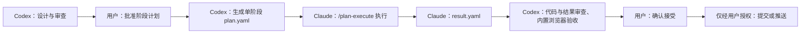

# 项目阶段路线图

> 本文是本仓库阶段状态、批准路线与执行门槛的单一事实来源，由 `docs/analysis/project-stage-ledger.md` 于 2026-09-01（plan-20260901-p1c）无损迁移至本规范归档路径。
>
> 产品讨论的原始问题与决策演变见外部 Raw：`D:/Projects/Project/lxw-wiki/Raw/2026-09-01-product-defects-and-evolution.md`。本文不替代来源核验、规则目录或每阶段的详细执行计划。
>
> 当前产品规范入口：[XuanXue 产品规范索引](../product/README.md)。当前运行环境为 `public_preview`，不等于已经具备正式生产资格。

## 1. 使用与记录规则

### 1.1 阶段状态

| 状态       | 含义                                                                           |
| ---------- | ------------------------------------------------------------------------------ |
| `Proposed` | 已提出的方向，尚未获用户批准。                                                 |
| `Approved` | 用户已批准方向与目标，尚未形成可执行计划。                                     |
| `Planned`  | 已有经用户确认的 `plan.yaml`，等待或正在交由 Claude 执行。                     |
| `On hold`  | 已有历史计划或方向，但用户明确暂停实施，必须重新确认后才能执行。               |
| `Executed` | Claude 已执行并产出 `result.yaml`；尚未完成 Codex 审查、浏览器验收或用户确认。 |
| `Accepted` | Codex 审查与浏览器验收完成，且用户已确认接受。                                 |
| `Blocked`  | 缺少必要事实、用户决策、权限或外部条件，不能安全进入下一步。                   |

### 1.2 每个阶段必须留存的证据

每个进入 `Planned` 或之后的阶段，必须在本节或阶段记录中链接以下证据：

1. 经用户批准的 `plan.yaml`；
2. Claude 实际执行后生成的 `result.yaml`；
3. 对应 Git 提交（如已提交）；
4. Codex 的代码/结果审查与内置浏览器验收记录；
5. 用户最终确认结论。

已执行的历史不得被覆盖。需求或方案改变时，应新建新版阶段记录，或将旧记录标注为 `superseded` 并链接替代记录；不得通过改写旧记录制造“从未发生”的假象。

### 1.3 当前文档与运行状态

- P0、P1 是已经接受的历史阶段；
- 产品总纲已经形成 `Approved` 规范，明确产品定位、目标用户、第一版成功标准、三层结构、功能准入、第一版范围和轻量版本治理；
- 用户档案、工具统一体验、基础重建与首批工具交付、八字、生肖/太阳星座、日期对照（内部标识 `zeji`）、八字关系对照（现有合婚退役）、称骨表对照（现有称骨算命下线）、周易卦象阅读（现有易经/六爻混合功能退役）、姓名笔画与五格对照（现有姓名测试退役）、测字双轨候选（现有测字占卜退役）和紫微斗数基础命盘（现有紫微预测功能退役）已经形成 `Approved` 产品规范，但这些规范尚未完成系统性代码实施和验收；
- 首页与每日内容已经形成 `Approved` 产品契约，但尚未实施和验收；梅花易数·起卦演示已经形成 `Approved` 产品契约并于 2026-09-06 完成用户审阅，但来源、实施和验收仍未完成，继续封存；八字关系对照继续封存，称骨表对照在具体底本确认前保持阻断，周易卦象阅读在来源、规则、实现和十七项重新开放门禁完成前保持内部隐藏，姓名笔画与五格对照在底本、81 数理、一级 3500 字账本、实现和十八项重新开放门禁完成前保持内部隐藏与计算禁用，测字双轨候选在规范字资料、权利、首批观照内容、实现和分能力门禁完成前保持内部隐藏、旧计算阻断与历史禁用，紫微斗数基础命盘在固定规则、来源账本、项目 DTO、内容整改和二十项重新开放门禁完成前保持内部隐藏、计算阻断与历史禁用，六爻排盘继续独立封存；
- 当前服务器属于 `public_preview`，未宣传不等于本地或私有；
- 首个治理版本基线 `0.1.0-preview.1` 仅为已批准目标，当前尚未修改产品版本、创建 Git 标签或形成发布记录；
- 本轮只进行阶段性文档治理收口，不生成、不执行代码实施计划，也不把未整改功能写成已完成。

### 1.4 2026-09-06 横向文档收口

- 用户授权先整理已有产品文档，暂不开发；本轮是直接文档修订，不新建 P 编号，不改变 P0/P1 的历史接受结论，不启动旧 P2；
- [收口审计记录](../audits/2026-09-06-product-document-closure-audit.md)集中记录本轮问题、修订、代码差距和验证边界；[产品索引](../product/README.md)第 6 章集中记录 11 个入口的代码快照、目标四维策略及验收后的历史目标；
- 本轮修订涉及公共结果状态、来源/人工审核、档案与领域职责、候选身份及目标/现状区分，不改变已批准的工具计算方法，不宣称任何来源已验证；
- 用户已接受前述文档基线说明，并授权本次待提交文档整理与过时正文修订，清单和验证见[收口记录第 8 章](../audits/2026-09-06-product-document-closure-audit.md#8-2026-09-06-待提交文档整理)。本次追加修订待审阅；未生成 YAML、未修改产品版本、未实施业务代码、未运行新的产品/浏览器验收，也不暂存、提交或推送。下一阶段及 Git 操作仍需独立授权。

### 1.5 2026-09-07 基础重建路线

- 2026-09-07 用户逐项批准[基础重建与首批工具交付规范](../product/delivery/foundation-rebuild-and-first-tools-delivery-spec.md)，固定 R1–R6 顺序；首批只打通生肖和八字基础排盘，太阳星座及其他候选不随本路线扩展；
- 未实施的代码问题以审计记录中的 GAP 条目和新交付规范承接。用户明确要求开始实施阶段后，才为 R1 准备单阶段计划；不要求先核验封存候选的全部来源；

## 2. 已完成阶段

### P0：未审核工具公开入口封存

| 项目       | 记录                                                                                                                                                                                                                                                                                                                                                                                  |
| ---------- | ------------------------------------------------------------------------------------------------------------------------------------------------------------------------------------------------------------------------------------------------------------------------------------------------------------------------------------------------------------------------------------- |
| 状态       | `Accepted`；已提交，尚未推送。                                                                                                                                                                                                                                                                                                                                                        |
| 目标       | 封存 `ziwei`、`hehun`、`meihua` 的公开入口，避免未审核能力继续被宣传、访问或产生新的计算结果。                                                                                                                                                                                                                                                                                        |
| 边界       | 仅处理公开可见性与旧链接兼容；不评价、核验或改造其计算规则，不删除既有路由、引擎或历史数据。                                                                                                                                                                                                                                                                                          |
| 计划       | `.claude/plans/plan-20260901-p0-tool-availability-containment.yaml`（原记录，结果已 `superseded`）；`.claude/plans/plan-20260901-p0a-recovery-and-typecheck.yaml`；`.claude/plans/plan-20260901-p0a-semantic-audit-recovery.yaml`；`.claude/plans/plan-20260901-p0a-public-copy-containment.yaml`；`.claude/plans/plan-20260901-p0a-global-metadata-and-route-regression.yaml`。      |
| 执行结果   | `.claude/results/20260901-p0-tool-availability-containment-result.yaml`（`superseded`）；`.claude/results/20260901-p0a-recovery-and-typecheck-result.yaml`；`.claude/results/20260901-p0a-semantic-audit-recovery-result.yaml`；`.claude/results/20260901-p0a-public-copy-containment-result.yaml`；`.claude/results/20260901-p0a-global-metadata-and-route-regression-result.yaml`。 |
| 提交       | `b0782db chore(tooling): 固定 Nuxt 类型检查依赖`；`69c9479 fix(tool-availability): 封存未审核工具公开入口`。                                                                                                                                                                                                                                                                          |
| 浏览器验收 | 用户已在真实本地浏览器确认：隐藏工具旧地址进入状态页；首页/导航不显示三项；移动端无文字重叠或横向溢出。                                                                                                                                                                                                                                                                               |

#### 落实点

- 建立工具可见性目录；
- 首页、最近记录、桌面导航与移动导航仅展示当前公开工具；
- 对隐藏工具实施精确路由围栏，并提供只读状态页；
- PWA、默认 SEO、Open Graph 与 Twitter 公开文案不再宣传隐藏工具；
- 固定 Nuxt 类型检查所需的开发依赖，并增加防止可见性回退的测试。

#### 验收证据

- 用户真实浏览器验收三项正常；
- `npm run typecheck` 通过；
- 测试：41 个文件、2057 项断言通过；
- `npm run lint` 无 error，保留 1 条既有 warning；
- 生产构建通过；常规构建曾受正在运行的本地开发服务锁影响，已通过不占用该锁的构建方式完成验证；
- `git diff --check`、提交检查与中文编码检测通过。

#### 明确不属于 P0 的后续事项

内容真实性治理、个人档案与单独同意、首页“今日观照”重组、移动端专项修复均不属于 P0，必须按后续阶段独立讨论、计划、执行与验收。

### P1：只读真实性与移动端根因审计

| 项目             | 记录                                                                                                                                                                                                                                                                                                                                                        |
| ---------------- | ----------------------------------------------------------------------------------------------------------------------------------------------------------------------------------------------------------------------------------------------------------------------------------------------------------------------------------------------------------- |
| 状态             | `Accepted`。                                                                                                                                                                                                                                                                                                                                                |
| 目标             | 逐项审计公开工具和首页输出的输入、规则、数据、模板/随机成分与可核对来源；同时定位移动端文字重叠、横向溢出及“注/算法溯源”交互问题的根因。                                                                                                                                                                                                                    |
| 非目标           | 不修改计算规则、UI、数据库、隐私逻辑或公开功能状态；不将未核验资料写成来源结论。                                                                                                                                                                                                                                                                            |
| 当前规范账本     | `docs/audits/2026-09-01-p1-truthfulness-and-mobile-audit.md` 的 P1.2 账本为 190 个独立展示点；分类 FR 84 / TC 49 / PCI 12 / UU 45，处置 retain 89 / relabel 91 / downgrade 9 / hide 1。其余来源、输入缺口、评分与移动端问题仍只是审计结论，未实施修复。                                                                                                     |
| 执行链           | 见下方 2.1。                                                                                                                                                                                                                                                                                                                                                |
| 接受依据         | 190 个公开展示点具备可联结输入、规则、代码定位、来源状态和处置（独立账本复核）；MethodologyNote 的移动端根因有不写入用户数据的真实浏览器证据（见 `docs/validation/2026-09-01-p1-mobile-browser-validation.md`）；用户已接受审计结论和必须收缩的公开内容范围。接受依据见 `docs/decisions/ADR-2026-09-01-001-p1-audit-acceptance-and-public-containment.md`。 |
| 已知不等同于完成 | 典籍与民俗来源仍未核验，其他移动问题尚未整体修复，结果生成后的自动保存、同意和历史治理仍未实施；这些均不因 P1 Accepted 而视为完成。                                                                                                                                                                                                                         |
| 进入 P2 门槛     | 已满足。P2 必须以 P1.2 账本和浏览器验证记录为依据，不得倒写任何未实施处置为已完成。                                                                                                                                                                                                                                                                         |

#### 2.1 P1 执行链

1. P1：`.claude/plans/plan-20260901-p1-truthfulness-and-mobile-root-cause-audit.yaml` → `.claude/results/20260901-p1-truthfulness-and-mobile-root-cause-audit-result.yaml`。已执行但报告 ID 回链、字段和统计失败；原正文未追踪且后来被覆盖，完整内容不可恢复。
2. P1.1：`.claude/plans/plan-20260901-p1a-audit-evidence-ledger-repair.yaml` → `.claude/results/20260901-p1a-audit-evidence-ledger-repair-result.yaml`。已执行但为保持 186 行吞并 4 个展示点，且全仓编码扫描记录失实；已 superseded。
3. P1.2：`.claude/plans/plan-20260901-p1b-atomic-ledger-and-evidence-correction.yaml` → `.claude/results/20260901-p1b-atomic-ledger-and-evidence-correction-result.yaml`。用户授权 Codex 直接完成文档纠正；独立只读复核已接受其 190 行账本、历史说明、范围和编码记录。P1/P1.1/P1.2 的可得历史见 `docs/audits/2026-09-01-p1-audit-evidence-history.md`。
4. P1 浏览器追加记录：`docs/validation/2026-09-01-p1-mobile-browser-validation.md`。已在安全的未提交表单路径复现 MethodologyNote 横向溢出和 Escape 失效，并如实记录环境仅到 3x 缩放、结果生成未测与用户的“删除注”决定。

## 3. 当前批准路线与阶段进入门槛

2026-09-07 用户已逐项批准六阶段基础重建路线。完整范围以[基础重建与首批工具交付规范](../product/delivery/foundation-rebuild-and-first-tools-delivery-spec.md)为准。截至 2026-09-15：R1、R2、R3、R4 均为 `Accepted`；R5 已进入实施（R5-B、R5-C、R5-D 均已提交，其中 R5-D 与交互可供性合并为单提交 `7877285`），阶段状态待用户确认；R6 为 `Approved`，未进入实施。R4 的接受限定为「本人档案初版」，不等于任何工具获准公开发放行。

### R1：安全收口

- 状态：`Accepted`。
- 目标：停止自动历史写入，建立工具目录的客户端与服务端围栏，排除认证、档案和历史接口的持久缓存。
- 非目标：不迁移或删除旧数据库，不重做页面，不恢复候选工具。
- 完成门槛：页面、直接路由和直接接口均不能自动创建历史或绕过计算、历史与缓存边界。
- 执行结果：
  - `.claude/plans/plan-20260907-r1-safety-containment-v2.yaml` → `.claude/results/20260907-r1-safety-containment-v2-result.yaml`；
  - 收敛修复 `.claude/plans/plan-20260907-r1-safety-containment-convergence-v3.yaml` → `.claude/results/20260907-r1-safety-containment-convergence-v3-result.yaml`；
  - 测试数据库隔离 `.claude/plans/plan-20260907-r1-test-database-isolation-v4.yaml` → `.claude/results/20260907-r1-test-database-isolation-v4-result.yaml`。
- 接受依据：用户已接受当前旧数据库哈希（DCC92D73…）为业务基线；提交 `2c61039` 已推送。原 905e5b40… 内容无法从仓库恢复。

### R2：账号与会话

- 状态：`Accepted`。
- 目标：建立与本人档案分离的账号模型、完整注册确认、独立设备会话和页内认证流程。
- 非目标：不在注册时建档，不绑定邮箱或手机号，不建设凭证找回和设备会话列表。
- 进入门槛：R1 `Accepted`（已满足）。
- 完成门槛：注册、登录、恢复、当前会话退出、退出失败、会话过期、全部会话失效和注销路径均符合数据与安全契约。
- 执行结果：
  - `.claude/plans/plan-20260908-r2-account-and-session-v1.yaml` → `.claude/results/20260908-r2-account-and-session-v1-result.yaml`；
  - 收敛修复 `.claude/plans/plan-20260908-r2-account-and-session-convergence-v2.yaml` → `.claude/results/20260908-r2-account-and-session-convergence-v2-result.yaml`；
  - 最终静态收敛 `.claude/plans/plan-20260908-r2-account-and-session-convergence-v3.yaml` → `.claude/results/20260908-r2-account-and-session-convergence-v3-result.yaml`；
  - 验收返修 `.claude/plans/plan-20260908-r2-account-and-session-acceptance-convergence-v4.yaml` → `.claude/results/20260908-r2-account-and-session-acceptance-convergence-v4-result.yaml`。
- 验证状态：2026-09-08 convergence v4 完成验收返修并通过全套验证，状态更新为 `Accepted`：
  - 自动化验收全绿：typecheck 0 错误；完整测试 53 文件 / 2133 用例通过；lint 0 error / 1 warning（`layouts/default.vue` 的 no-useless-assignment，不在计划修改范围）；`npm run build` 成功（修复 securityLog 缺失导出导致的 Nitro MISSING_EXPORT）；`git diff --check` 通过；改动文件乱码检测 0 命中。
  - 浏览器验收（生产 `node .output/server/index.mjs` preview，DB_PATH 指向 os.tmpdir 下独立临时库、独立 SESSION_SECRET）：游客访问 /account 正确 replace /login；唯一昵称注册进入 /account 且响应只含 account 不暴露 token/profile；两个独立会话并存；当前设备退出只使当前会话失效（另一会话仍可恢复）；退出所有设备使两个会话均失效；错误密码与不存在账号返回同一 401 文案（防枚举）；一次性账号注销弹层的初始焦点、Tab/Shift+Tab 循环、Escape 关闭与焦点返回触发按钮均验证通过，正确凭证注销后账号删除、昵称可重新注册；320/360/390/414 CSS px 下登录、注册、账号页与注销弹层均无横向溢出、控件可达；320 CSS px + 200% 根字号重复关键流程无溢出；auth/me、profiles、divinations、logout 敏感 API 响应均含 `Cache-Control: no-store`。
  - 数据库安全：验收前后 xuanxue.db SHA256 保持 `DCC92D73…8AAC` 不变；项目根未生成 xuanxue-r2.db；本轮 preview 临时数据库目录在验收后已精确删除；R1 提交 `2c61039` 未变。
- 后续：R3 进入门槛（R2 `Accepted`）已满足，但 R3 尚未实施、未发起计划，本段不构成 R3 已开始的记录。
- 入口与落脚点调整（2026-09-13）：登录 / 注册 / 会话恢复后的落脚点由 `/account` 改为 `/self-profile`；`/account` 重做为出版版「账号与安全」（Ⅰ 账 / Ⅱ 话 / Ⅲ 数 / Ⅳ 销），不再是落脚点，只从顶栏账号菜单进入（菜单仍为三项：账号与安全 / 本人档案 / 退出）。账号级销毁（注销）留在账号页，档案级删除（均保留账号）留在档案页，两类爆炸半径不同的操作不混放。R2 的三条流程（退出当前设备 / 退出所有设备 / 注销）已按新结构真机复跑。设计见 [账号与档案信息架构调整设计](../design/2026-09-13-account-and-profile-ia.md)，验收见 [IA 调整验收](../audits/2026-09-13-account-and-profile-ia-acceptance.md)。

### R3：游客草稿与生肖

- 状态：`Accepted`（2026-09-09 用户在技术验收后确认继续，接受限定功能交付；不代表批准公开）。
- 目标：以生肖验证游客优先、页面内草稿、浏览器本地计算和零服务器历史。
- 非目标：不实现生肖历史，不收集时间、地点、性别或现实状态，不扩展太阳星座。
- 进入门槛：R2 `Accepted`（已满足）。
- 完成门槛：游客可完成“查我的生肖”和“认识十二生肖”，输入修改、刷新清除、农历新年边界及 1901 年至查询当日范围均通过验收；生肖来源台账和独立黄金样例满足公开准入。
- 历史过程：v1 证据准备后，Codex 判定 `evidence_incomplete`，经 v2/v3 修正日期预期、来源语义、字段结构及引用定位；历史计划和 result 保留，不回改为成功。
- Codex 补证同步（2026-09-09）：[历法附录](../audits/2026-09-09-r3-calendar-evidence-addendum.md)补齐国标目标条款扫描页及1900年首独立同期记录；[来源台账](../product/evidence/shengxiao/shengxiao-source-ledger.md)明确电子转录采用版本、卷次及疑字边界；[规则台账](../product/evidence/shengxiao/shengxiao-rule-ledger.md)和[R3 实施映射](../audits/2026-09-09-r3-shengxiao-implementation-map.md)同步引用与结论。
- 资料缺口 BLK-001/004/007/008 已关闭；BLK-005/006 是未核验的可选扩展，第一版不展示。基础公共文化浏览保留生肖次序、地支对应与干支循环；不因可选资料未取得阻塞第一版。
- [黄金样例](../product/evidence/shengxiao/shengxiao-golden-cases.yaml)：26个日期预期（18 success、6 invalid_input、2 unsupported_input），成功预期的传统分类四字段及版本/时区已补齐；新增60条六十甲子分类预期，合计86条，0 unresolved、1 optional。覆盖60干支、12生肖/地支、10天干、30纳音组；未运行，计数不代表测试通过，也不代表全部支持年份的日期换算已覆盖。
- 证据包已[通过限定范围的实施前资料审阅](../audits/2026-09-09-r3-evidence-package-review.md)，采用来源的限定主张已批准，运行与公开验收未完成。v4 补证计划已由用户作废，Codex 直接取得的证据保留；不再交执行器重复补证。
- 运行验收（2026-09-09）：v1 实施及 v2/v3 收敛后，用户明确授权验收。typecheck/test/lint/build 通过（57 文件、2170 用例；lint 1 条既有 warning）；四档移动宽度与 200% 文本根字号通过组件浏览器检查，126 年春节边界及 378 日期通过独立官方历表核对。详见[运行验收记录](../audits/2026-09-09-r3-shengxiao-runtime-acceptance.md)，其中区分真实生产围栏、隔离组件交互、图片导出及独立引擎差异。
- 后续：R3 限定功能验收已获用户接受，满足 R4 进入条件；独立公开准入留在公开门禁流程处理。公开围栏保持 `in_review/internal/blocked/disabled`；用户已批准将本轮开发分支统一更名为 `codex/foundation-rebuild` 并提交推送。隔离组件验收不冒充当前生产路由已经公开可用。以上记录覆盖先前“实施未开始/黄金未运行”的历史描述。
- 用户优先级（2026-09-09）：先跑通功能、数据流程与已批准要求；产品 UI 视觉打磨后置。输入可操作、错误可恢复、基本可访问性和隐私边界仍属功能验收要求，不因后置视觉打磨而取消。

### R4：本人档案

- 状态：`Accepted`（2026-09-14 用户确认接受）。接受限定为「本人档案初版」：功能、数据流程与已批准要求成立，工具公开围栏不变，不代表公开放行，也不把 R4 的授权延伸为 R5 的构建测试授权。（历史：2026-09-13 完成自动化、生产预览临时库与窄屏浏览器验收；同日提交后复验发现提交钩子格式化使提交树三项门禁失败，已完成最小修复、重跑四项门禁并在修复树上复跑真机浏览器验收 35/35；此后又完成出版版视觉对齐 51/51 与账号/档案信息架构调整 32/32，均待用户接受，现已接受。）
- 目标：建立 `Account 1 — 0..1 SelfProfile`，第一批只保存完整出生日期字段组，并打通档案向生肖草稿的显式复制。
- 非目标：不加入出生时间、地点、传统排盘参数、亲友档案或强制建档。
- 进入门槛：R3 `Accepted`。
- 当前准备：R3 门槛已满足；R4 v1 已实施但静态审阅发现保存、差异确认与资料失效缺口，须先执行 v2 收敛计划。衔接基线为已提交 R3 `45ad4a7` 加未提交 R4 文件指纹，沿用 `codex/foundation-rebuild`；原 v1 执行起点保留为历史。R4 执行不自动提交或推送；R3 的运行授权不自动延伸为 R4 的构建测试授权。详见 [Codex 静态审阅](../audits/2026-09-09-r4-self-profile-codex-review.md)。
- 实施计划：`.claude/plans/plan-20260909-r4-self-profile-v1.yaml`（8 个任务；只编写实现与验证用例，执行完成保持 `implemented_verification_pending`）；v2 收敛 `.claude/plans/plan-20260909-r4-self-profile-convergence-v2.yaml`（保存约束/HTTP 契约/账号生命周期/资料失效/冻结确认，只写修复与回归）；v3 收敛 `.claude/plans/plan-20260909-r4-self-profile-convergence-v3.yaml`（通知生命周期/游客认证/失效传播/读取确认/NULL 反例，只写修复与回归）；v4 收敛 `.claude/plans/plan-20260909-r4-self-profile-convergence-v4.yaml`（确认快照原子作废/来源快照与代际/本地保存来源同步协议/loading token 化/频道归属，只写修复与回归）。
- 执行结果：`.claude/results/20260909-r4-self-profile-v1-result.yaml`（历史）；v2 结果 `.claude/results/20260909-r4-self-profile-convergence-v2-result.yaml` 已经 Codex 静态复核；v3 结果 `.claude/results/20260909-r4-self-profile-convergence-v3-result.yaml` 已经 Codex 静态复核，仍有显示候选与冻结请求不一致、来源 await 后可能为空、同页保存来源同步时序、loading 跨代际扣减与频道归属残留；v4 结果 `.claude/results/20260909-r4-self-profile-convergence-v4-result.yaml`（待 Codex 复核），详见 [v3 静态复核](../audits/2026-09-09-r4-self-profile-convergence-v3-review.md)。
- 实施审计：[R4 实施结果审计](../audits/2026-09-09-r4-self-profile-implementation-result.md)；v2 收敛审计 [R4 收敛结果审计](../audits/2026-09-09-r4-self-profile-convergence-v2-result.md)；v3 收敛审计 [R4 收敛结果审计（v3）](../audits/2026-09-09-r4-self-profile-convergence-v3-result.md)；v4 收敛审计 [R4 收敛结果审计（v4）](../audits/2026-09-09-r4-self-profile-convergence-v4-result.md)。
- 验证状态：typecheck、full test、lint、build 已运行；生产预览使用系统临时目录新库完成注册、建档、修改、撤回、重新授权、版本冲突、日期删除、整档删除与会话保留验收；320/360/390/414 CSS px 及 200% 根字号无页面横向溢出，保存对话框在 320px + 200% 下可滚动、按钮可见且可操作。详见 [R4 Codex runtime acceptance](../audits/2026-09-11-r4-self-profile-runtime-acceptance.md)。
- 提交后复验与浏览器验收（2026-09-13）：上述通过结论只对**提交前的未格式化树**成立。`.githooks/pre-commit` 的 `lint-staged`/`prettier --write` 在验证之后改写了源码，使提交 `53cd19d` 上 typecheck、测试与构建三项失败（2289 通过 + 编译失败的 45 例 = 验收文档声称的 2334）。已复验驳回并完成最小修复（`pages/tools/shengxiao.vue` 的多语句内联处理器改为具名方法；测试改用显式断言辅助函数替代会被格式化孤立的 `@ts-expect-error`）。修复后四项门禁在格式化稳定的树上重新通过：typecheck 0 错、测试 64 文件 / 2334 用例、lint 0 error / 26 warnings、build 成功。随后在生产预览 + 系统临时目录全新数据库上复跑真机链路：注册、建档、差异确认、409 冲突与重读、停止/重新允许带入、删除出生日期保留档案、删除整档保留会话、公开围栏（`/tools/shengxiao` → `/tools/status`）、320/360/390/414 CSS px × 16px/32px 无横向溢出、320px + 200% 弹层可滚动且确认按钮可达、26 条 `/api/self-profile` 响应全部 `no-store`，共 **35/35 通过**；证据存于仓库外 `D:/@Temp/xuanxue-evidence/2026-09-13-r4-verify/`（含 SHA256 清单；按用户要求不纳入仓库）。公开围栏下不可达的带入/替换/撤销由 125 例组件级测试承担。同轮把 `.githooks/pre-commit` 从改写型（`prettier --write`/`eslint --fix`）改为门禁型（`prettier --check`/`eslint`），`.prettierignore` 排除 archify 生成的 `docs/architecture/*.html`，使 `npx prettier --check .` 全仓通过。该轮结束时 R4 仍为 `Implemented`、待用户接受；2026-09-14 用户确认接受，见本阶段「状态」与「接受依据」。全过程见 [R4 验收复验（驳回）](../audits/2026-09-13-r4-self-profile-acceptance-review.md)。
- 完成门槛：创建、差异确认、版本冲突、字段组删除、整档删除、带入、替换和撤销均符合契约。**已满足**（2026-09-13 修复树真机 35/35 + 出版版视觉 51/51 + 信息架构 32/32；2026-09-14 用户确认接受）。
- 接受依据（2026-09-14）：四项门禁在格式化稳定的树上通过（typecheck 0 错、测试 67 文件 / 2379 用例、lint 0 error / 26 既有 warnings、build 成功、`npx prettier --check .` 全仓通过、`git diff --check` 通过）；三轮真机浏览器验收证据（R4 复验 35/35、出版版视觉 51/51、信息架构 32/32）均已交付并复核；用户明确表示接受本人档案初版，并授权提交推送。提交：`e473a3c fix(r4): 修复提交钩子格式化导致的验收失效`、`4dd43c6 feat(r4): 本人档案初版（出版版视觉与账号信息架构调整）`，已推送至 `codex/foundation-rebuild`。证据与截图存于仓库外 `D:/@Temp/xuanxue-evidence/`（按用户要求不纳入仓库）。接受范围**不包括**公开围栏放开：工具目录仍为 `in_review/internal/blocked/disabled`。
- 接受时已知限制：`/tools/` 围栏下「带入 / 替换 / 撤销带入」无真实浏览器路径（由 125 例组件级测试承担）；R4 构建测试授权不延伸至 R5。
- 出版版视觉对齐（2026-09-13）：按用户批准的设计基线，把 `/self-profile` 对齐本人档案出版版原型——卷目索引（Ⅰ 录 / Ⅱ 授 / Ⅲ 溯 / Ⅳ 归）+ 报头 + 分节 + 记录卡，并补齐 Ⅱ 四类用途矩阵（取自数据生命周期规范 §10.1）、Ⅲ 溯源与范围、Ⅳ 归档与删除（默认折叠）。仅页面级改动：未动全站顶栏、页脚、数据层与 API；新增全局按钮类 `btn-solid`/`btn-quiet` 与 7 个展示型组件，均已登记进 [设计系统](../design/design-system.md)。涉及 R5 结果历史的原型文案（历史条数、旧输入标记）按"不承诺未实现能力"改写。设计基线见 [出版版视觉对齐设计](../design/2026-09-13-self-profile-editorial-redesign.md)，验收见 [出版版视觉对齐验收](../audits/2026-09-13-self-profile-editorial-acceptance.md)：typecheck/lint/build/prettier 通过，测试 66 文件 / 2365 例通过，真机验收 **51/51 通过**（含三态、409 冲突重读、带入授权开关、危险区折叠、320/360/390/414 × 16px/32px、320px+200% 弹层、`no-store`），证据存于仓库外 `D:/@Temp/xuanxue-evidence/2026-09-13-self-profile-editorial/`（含 SHA256 清单；按用户要求不纳入仓库）。该轮结束时 R4 仍为 `Implemented`、待用户接受；2026-09-14 用户确认接受，见本阶段「状态」与「接受依据」。

### R5：八字基础排盘与结果历史

- 状态：`Approved`；**已进入实施**，最终阶段状态待用户确认（截至 2026-09-15）。
- 目标：只用出生日期生成可追溯的三柱部分结果和节气边界候选，并建立首个显式保存、服务端复算、不可变快照与删除闭环。
- 非目标：不输出时柱、大运、流年、神煞、强弱、喜用神、评分或现实预测。
- 进入门槛：R4 `Accepted`（2026-09-14 已满足）。
- 实施进展（2026-09-15 核对）：
  - `constants/tool-catalog.ts` 中 `bazi` 已为 `computePolicy: enabled` + `historyPolicy: create_allowed`，`exposure` 仍为 `internal`；普通访客仍被围栏重定向，内部验证由 `XUANXUE_INTERNAL_TOOLS` 白名单控制且默认关闭；
  - 已提交 `c1eb1eb`（R5-B 基础排盘与结果历史）、`7073f5d`（R5-C 八字页 UI 改造）、`481cef9`（出版版版式对齐设计基线）、`7877285`（R5-D 出版版外壳，含交互可供性第二轮，合并为单提交）；
  - 新引擎位于 `utils/bazi/*`；旧 `composables/useBaZi.ts` 的日柱锚点错误已于 `89f626d` 修正（改复用 `utils/bazi/pillars.ts` 的 `dayGanZhiIndex()`，日柱规则只保留一处实现），`useHeHun.ts` 经 `calculateBaZi` 自动获得正确日支，围栏内不对外。
- 完成门槛：普通日期部分结果、节气边界候选、页内认证后二次确认、幂等保存、快照读取、重新计算和删除全部通过；八字日期、节气和甲子日来源及黄金样例满足对应准入。
- 完成门槛**尚未满足**：第三方独立复核（[2026-09-15](../audits/2026-09-15-third-party-full-review.md)）记录多项来源仍为 `unreviewed`，分钟级外部核验只覆盖 2026 一年。

### R6：全链路验收与公开门禁

- 状态：`Approved`。
- 目标：联合验证游客、账号、会话、本人档案、生肖、八字、历史、删除、隐私和失败状态。
- 非目标：不扩展首批工具，不以验收阶段顺带实现新能力。
- 进入门槛：R1–R5 均已实施并具备各自验证证据。
- 完成门槛：自动化、来源、直接接口、真实浏览器、320/360/390/414 CSS 像素宽度、200% 文本缩放和用户验收全部通过。

## 4. 已被替代的旧路线

下列 P2–P7 路线记录此前获批方向，现已由 R1–R6 替代并统一标记为 `Superseded`。历史计划和文字原样保留用于追溯，不得执行，也不能替代当前交付规范。

### P2：公开真实性收缩

- 状态：`Superseded`。历史计划 `.claude/plans/plan-20260901-p2-public-truthfulness-containment.yaml` 尚未执行并原样保留，不得继续执行；其中自动历史和公开围栏问题由 R1 重新承接，其余内容整改继续受单项契约约束。
- 目标：以 P1.2 账本为依据收缩公开的未核验内容：删除全部工具页“注/算法溯源”UI（不以 CSS 修补或未核验来源替代）、移除 9 个公开工程评分展示、隐藏生肖逐月运势 UI、修正称骨默认输入补全。
- 非目标：不核验典籍来源，不恢复隐藏工具，不治理自动保存/同意/历史保存，不做全站移动端验收，不接入 AI、不新建 Spring Boot、不拆微服务。
- 必须验收：公开页面不再渲染“注”UI 与被指定的评分/逐月展示；称骨五项输入完整前不得计算；`npm run typecheck`、`npm run test`、`npm run lint`、`npm run build` 通过；桌面与 320/360/390/414 CSS 像素宽度浏览器验收。
- 进入 P3 门槛：公开收缩范围经 Codex 审查与浏览器验收、用户确认接受。

### P3：八字基础事实与结果凭证试点

- 状态：`Superseded`；相关范围由 R5 重新承接。
- 目标：建立结果可追溯的最小凭证结构，并仅以八字基础排盘中的可复算事实作为试点。
- 非目标：不接入 AI、不新建 Spring Boot、不拆微服务、不恢复隐藏工具，不将传统分类包装为现实预测。
- 必须验收：结果能说明实际使用的信息、缺失条件、规则/来源版本、生成时间与限制；关键出生信息不足时明确降级；不展示用户可见分数或必然性现实承诺；桌面与 320/360/390/414 CSS 像素宽度均可用。
- 进入 P4 门槛：试点的事实范围、凭证字段与保存前置条件经用户接受，且无证据不足内容被伪装为个人结论。

### P4：档案、单独同意与历史保存

- 状态：`Superseded`；相关范围拆入 R2、R4 和 R5。
- 目标：分离出生档案、可变状态与当次语境，落实最小必要、单独同意、主动保存、撤回与删除的治理边界。
- 非目标：不以一次隐私政策同意替代所有用途授权；不强制反复填写可变状态；不在未同意时自动保存结果。
- 必须验收：拒绝授权时相应字段不参与结果且不保存；撤回/删除后的行为符合已声明规则；用户能理解每项资料的用途、必要性与更新方式；历史记录不静默重算。
- 进入 P5 门槛：涉及保存、撤回、删除的本地用户资料操作，已取得用户针对测试数据的专门授权并完成验收。

### P5：首页与每日内容

- 状态：`Superseded`；首页与每日内容不属于当前 R1–R6 首批路线，产品契约继续有效。
- 产品契约：`docs/product/contracts/homepage-and-daily-content-contract.md`。
- 目标：将首页重组为稳定公共发现空间和真实个人延续入口；以北京时间统一快照提供“今日事实、节气一读、今日观照”，同时提供“按目标探索 + 直接选择方法”双入口。
- 非目标：不虚构个人“今日运势”，不读取档案生成每日内容，不猜测关系、职业或学习状态，不保留自动命签和今日穿衣，不催促建档，不进行未经用户确认的整体视觉重设计。
- 必须验收：游客无需登录即可完成公开探索；只有真实历史存在时展示“继续探索”；三层每日内容共享日期上下文并分层失败；来源与限制处于正常阅读流；未批准工具不出现；工程验证通过；Codex 使用内置浏览器完成登录状态、交互、320/360/390/414、200% 文字缩放、400% 回流与 500% 压力复验；用户在真实手机完成手动验收并明确接受。
- 进入 P6 门槛：首页实现经 Codex 独立审查和内置浏览器验收、用户真实设备确认接受，且遗留的跨页面移动问题已经列入 P6 明确范围。

### P6：移动端稳定性专项

- 状态：`Superseded`；首批移动端要求并入各阶段及 R6，不再作为紧随首页的独立阶段。
- 目标：基于 P1 根因，修复小屏文字重叠、固定宽度、横向滚动、弹层和触控问题，并保留浏览器缩放能力。
- 非目标：不以全局禁缩放、全局 `overflow: hidden` 或逐页临时遮掩解决问题。
- 必须验收：在 320、360、390、414 CSS 像素宽度下，无页面横向溢出、文字重叠、遮挡或无法关闭的弹层；关键按钮可用、内容可滚动、浏览器缩放仍可用；Codex 在内置浏览器记录实际验收。
- 进入 P7 门槛：公共组件的响应式约束已稳定，且没有以牺牲可访问性换取视觉表面通过。

### P7：工具逐项来源核验、恢复或继续隐藏及公开试运行/展示前整体验收

- 状态：`Superseded`；当前只验收生肖和八字首批范围，其他工具仍按单项契约保持围栏。
- 目标：按真实性门槛逐个决定工具的公开范围（来源逐项核验、恢复或继续隐藏），并完成公开试运行、日常展示或毕业设计所需的全链路验收、项目说明与可追溯资料整理。
- 非目标：不以功能数量作为进度，不默认恢复 `ziwei`、`hehun`、`meihua`，不绕过来源、输入条件或隐私审核；不因展示需求跳过真实性、隐私、移动端或既有功能的验收门槛；不在此阶段默认引入微服务或 AI。
- 必须验收：每项工具有完整输入条件与降级策略；每条输出可追溯规则与来源；无随机伪个性化、用户可见评分或现实承诺；符合 P4 的同意、保存与历史要求；通过自动化与真实浏览器/移动端验收；覆盖访客探索、同意、建档、个人结果、主动保存、修改、撤回/删除的真实路径；公开文案、PWA、分享信息、导航和历史不泄漏未审核功能；代码、规则说明、数据模型、测试说明与产品演进记录一致。
- 完成门槛：用户确认全链路验收结论，并明确授权最终提交或推送操作。

## 5. 协作与提交流程

1. Codex 负责调查、方案设计、范围控制、执行结果审查和内置浏览器验收；
2. 用户先批准阶段目标、非目标与验收标准，Codex 才生成该阶段单独的 `plan.yaml`；
3. Claude 按用户提供的 `/plan-execute` 执行计划，并写入真实的 `result.yaml`；
4. Codex 不以自动化测试替代浏览器验收，用户也可随时在任一阶段提出更好的想法并讨论；
5. 只有用户明确授权时，才进行 Git 提交或推送；
6. 涉及创建、保存、修改、撤回或删除本地用户资料的浏览器测试，必须先取得用户针对测试数据的专门授权。

## 6. 协作者归属规则

Git 提交 trailer 只能列入实际执行或实际贡献该提交的实体，不得因工具、讨论或计划存在而虚构协作者。

本次 P0 的两笔提交仅由 `LiXinwen` 实际署名和提交，因此不应附加 ChatGPT、Claude 或其他虚构协作者 trailer。后续每笔提交应按实际贡献重新判断。

## 7. 归档迁移记录

- 2026-09-01（plan-20260901-p1c）：本文由 `docs/analysis/project-stage-ledger.md` 迁移建立。P0/P1 历史与证据链接保留不变；原“P2 结果凭证与八字基础事实试点”及后续阶段顺延为 P3–P7；新增 P2 公开真实性收缩（`Planned`）。P1 证据改链至 `docs/audits/`、`docs/validation/`、`docs/decisions/` 规范归档路径。
